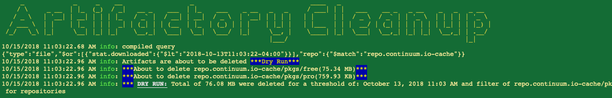

# artifactory-cleanup

[](https://app.codacy.com/app/gkohen/artifactory-cleanup?utm_source=github.com&utm_medium=referral&utm_content=JDASoftwareGroup/artifactory-cleanup&utm_campaign=Badge_Grade_Dashboard)

<p align="center">
    <a href="https://travis-ci.com/JDASoftwareGroup/artifactory-cleanup"></a>
    <a href="https://codecov.io/gh/JDASoftwareGroup/artifactory-cleanup"></a>
    <a href="https://opensource.org/licenses/MIT"></a>
    <a href="https://github.com/JDASoftwareGroup/artifactory-cleanup/pulls"></a>
</p>

## Background
In a development organization dependency management is key to sharing 3<sup>rd</sup> party and in-house common libraries 
as well as build artifacts to be deployed to the cloud and in-premise. Artifactory, by JFrog is such as solution that is 
provided as both a PaaS offering and in house solution for dependency management.
The issue with such systems is that after a while, you start to accumulating old artifacts, such as 
libraries versions not used or outdated binaries that are no longer used. 
Having these extra artifacts will result in higher monthly cost for the Artifactory PaaS offering as well as slow down 
your server and make it more difficult for team members to navigate. Out of the box Artifactory *will* clean up snapshot
libraries only.
We were looking for a utility that would allow generating a report for artifacts that have not been used in a while. 
A good solution would be able to run the utility from a CI/CD server. Further, we wanted to let users with the right 
permissions and credentials to be able to run remotely.
Inspired by a JFrog's cleanup plugin for in-premise servers, we decided to create this utility that fits the bill.

## Description
*artifactory-cleanup* allows an Artifactory user with admin permissions to get a list of all artifacts that have not
been in user in more than a specified period of time. You could specify a time period such as 6 months or use a 
specific date.
If you run the utility in a dry run, only a report will be generated. Otherwise, the files that fit the criteria will
be removed from your artifactory.  

## Prerequisites

You will need to have [NPM](https://www.npmjs.com/get-npm) installed on your machine. 

## Installation

```sh
$ npm install -g artifactory-cleanup
```

## Usage

```
artifactory-cleanup [options]

Options:
  --help                   Show help                                                                                                        [boolean]
  --version                Show version number                                                                                              [boolean]
  -a, --artifactoryApiUrl  Artifactory server API URL                                                                                      [required]
  -u, --user               Artifactory user with permission to API                                                                         [required]
  -q, --quiet              Quiet down output                                                                                                [boolean]
  -t, --token              Artifactory user generated token                                                                                [required]
  -f, --filter             Repository filter                                                                                     [default: "*-local"]
  -p, --path               Path prefix filter
  -l, --logging            logging level                                              [choices: "error", "warn", "info", "verbose", "debug", "silly"]
  -d, --date               Threshold date (ISO-8610 format)
  -k, --keep               Threshold to keep only nth newest artifact parent folders                                                         [number]
  -o, --duration           Duration of time for threshold. To be combined with `unit` parameter
  -n, --unit               Unit of time for threshold. To be combined with `duration` parameter
     [choices: "years", "y", "quarters", "Q", "months", "M", "weeks", "w", "days", "d", "hours", "h", "minutes", "m", "seconds", "s", "milliseconds",                                                                                                                                              "ms"]
  -r, --dryrun             Dry run of the utility. Not files will be deleted

```

## Example



## Contributing

Please read [CONTRIBUTING.md](CONTRIBUTING.md) for details on our code of conduct, and the process for submitting pull requests to us.

## Versioning

We use [SemVer](http://semver.org/) for versioning. For the versions available, see the [tags on this repository](https://github.com/jda/artifactory-cleanup/tags). 

## Authors

* **[Gabriel Kohen](http://github.com/gkohen)** - *Initial work* - [JDA Software](https://github.com/jda)

See also the list of [contributors](https://github.com/jda/artifactory-cleanup/contributors) who participated in this project.

## License

This project is licensed under the MIT License - see the [LICENSE.md](LICENSE) file for details


